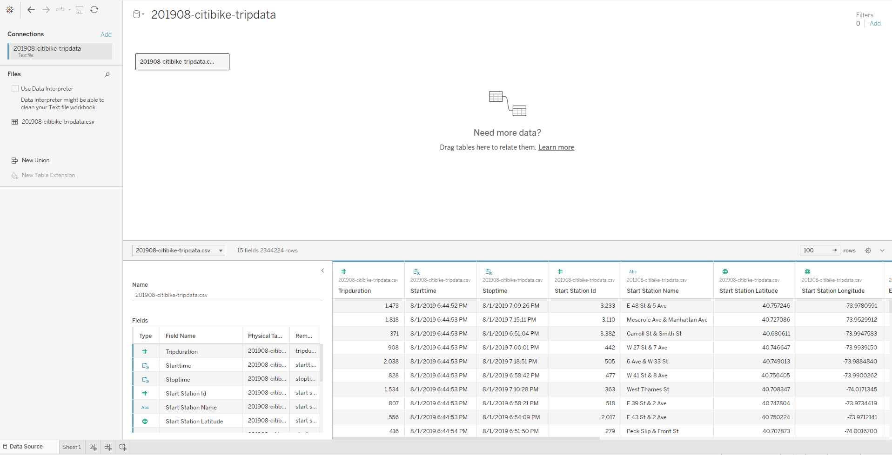

# NYC Citi Bike Summary for August 2019

## Resources
Data source: 201908-citibike-tripdata.csv

Software: Tableau Desktop Public Edition Version 2023.1

## Project Overview
### Use the provided csv file to create a dashboard.

Tasks include:

1. Importing the data into Tableau
2. Determining the total number of trips taken in August
3. Finding the ratio of male to female users
4. Finding the ratio of short term customers to annual subscribers
5. Finding the peak riding hours in August
6. Finding the average tripduration by age
7. Finding top starting locations
8. Finding top ending locations

## Results & Analysis

<iframe width="560" height="315" src="https://www.youtube.com/embed/pBy1zgt0XPc" title="YouTube video player" frameborder="0" allow="accelerometer; autoplay; clipboard-write; encrypted-media; gyroscope; picture-in-picture; web-share" allowfullscreen></iframe>

[Link to view the Dashboard](https://public.tableau.com/views/nyc201908/NYCCitiBikeSummary?:language=en-US&:display_count=n&:origin=viz_share_link)

After inspecting the csv file, I connected it to Tableau as a text file. 

Next, I inspected the measures and dimensions and noticed that most of them were categorized incorrectly. The image on the left is the before and the image on the right is the after.

   

Since the original data categorized gender into a 0, 1, or 2, I had to create a calculated field to detemine gender based on the value assigned.

Trip duration was also originally measured in seconds, so I created a calculated field to convert it into minutes to make more sense to the viewer.

Lastly, I created a calculated field to determine the age of each user since that would make more sense to the viewer than seeing their birth year.

## Drawing Insights

1. There were 2.3 million trips taken in August 2019 with the average trip duration being 17.5 minutes.
2. A majority of the users in August 2019 were male subscribers.
3. The top 15 starting and ending locations closely resemble each other.
4. The peak riding hours are 8 AM and 5 PM.
5. Looking at the chart that displays average trip duration by age, it appears that younger riders tend to utilize the bikes for longer periods. It is worth noting, however, that there are some notably high ages present in the data. Citi Bike reports the birth year as 1885 when it is unknown or missing, leading to these unusually high ages. It is possible that some of the remaining high ages are a result of users intentionally entering false birth years to safeguard their privacy or for other reasons.

---

    
Return to the <a href="https://kenlo94.github.io/">Homepage</a>

    
View the Project on <a href="https://github.com/kenlo94/Pewlett-Hackard-Analysis">GitHub</a>

