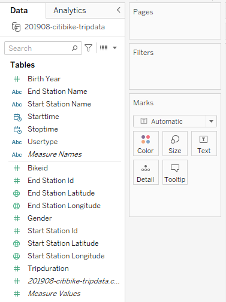
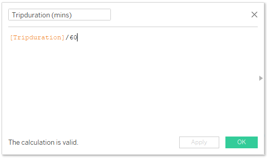

# NYC Citi Bike Summary for August 2019

## Resources
Data source: 201908-citibike-tripdata.csv

Software: Tableau Desktop Public Edition Version 2023.1

## Project Objectives
### Use the provided csv file to create a dashboard to tell the best possible data driven story.

## Processing and Visualization
After inspecting the csv file, I connected it to Tableau as a text file. 

Next, I inspected the measures and dimensions and noticed that most of them were categorized incorrectly. The image on the left is the before and the image on the right is the after.

   

Since the original data categorized gender into a 0, 1, or 2, I had to create a calculated field to determine gender based on the value assigned.

Trip duration was also originally measured in seconds, so I created a calculated field to convert it into minutes to make more sense to the viewer.

Lastly, I created a calculated field to determine the age of each user since that would make more sense to the viewer than seeing their birth year.

View the Dashboard on [Tableau Public](https://public.tableau.com/views/NYCCitiBikeAugust2019/NYCCitiBikeSummary?:language=en-US&:display_count=n&:origin=viz_share_link" target="_blank)

## Drawing Insights

1. There were 2.3 million trips taken in August 2019 with the average trip duration being 17.5 minutes.
2. A majority of the users in August 2019 were male subscribers.
3. The top 15 starting and ending locations closely resemble each other suggesting that these areas are densely populated or have a high concentration of businesses or attractions that people are traveling to or from.
4. The peak riding hours are 8 AM and 5 PM, likely meaning that people are using the bikes for commuting to and from work.
5. It appears that younger riders tend to utilize the bikes for longer periods. It is worth noting, however, that there are some notably high ages present in the data. Citi Bike reports the birth year as 1885 when it is unknown or missing, leading to these unusually high ages. It is possible that some of the remaining high ages are a result of users intentionally entering false birth years to safeguard their privacy or for other reasons.

---
Return to the [Homepage](https://kenlo94.github.io/)
